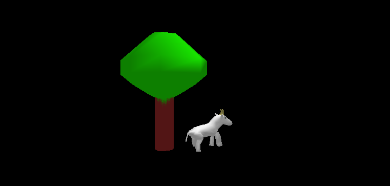

Serial Model Renderer
=====================

Used for testing 3D model file parsing and rendering for robustness of the 
[small3d game development library](https://github.com/dimi309/small3d), this program will serially load and render 3D models
and rotate them on the screen.

This repository contains the small3d repository as a submodule. Use 
the `--recursive` flag when cloning, otherwise the small3d subdirectory 
will remain empty on your drive.

Before building, run the appropriate small3d dependencies preparation script
from small3d/deps/scripts.

Then from the main repository execute:

	mkdir build
	cd build
	# add -G"Visual Studio 17 2022" or -G"MinGW Makefiles" below
    # if building on Windows
	cmake .. -DCMAKE_CXX_STANDARD=17 
	cmake --build . # add --config Debug or --config Release if 
	                # building on Windows
					
You can then start the program by running `srender` from `build/bin`.
You can add your own 3D models in `build/bin/resources/models` and see
how small3d does loading and rendering them. small3d can handle glTF (.glb)
and Wavefront (.obj) files.
					
This is an integrated build with small3d, so including header files from the 
library in the serial model renderer source code is done with double quotes and 
without the small3d/ directory prefix, for example `include "Renderer.hpp"` 
and not `include <small3d/Renderer.hpp>`.
		 
The 3D models distributed with this project are admittedly neither very good 
looking nor very intricate in structure. This is because I have made them 
myself. I did not want to redistribute models provided by third parties in case 
I make a mistake with regard to their lincensing and redistribution terms. But 
the program has been tested with many models found on the internet.

